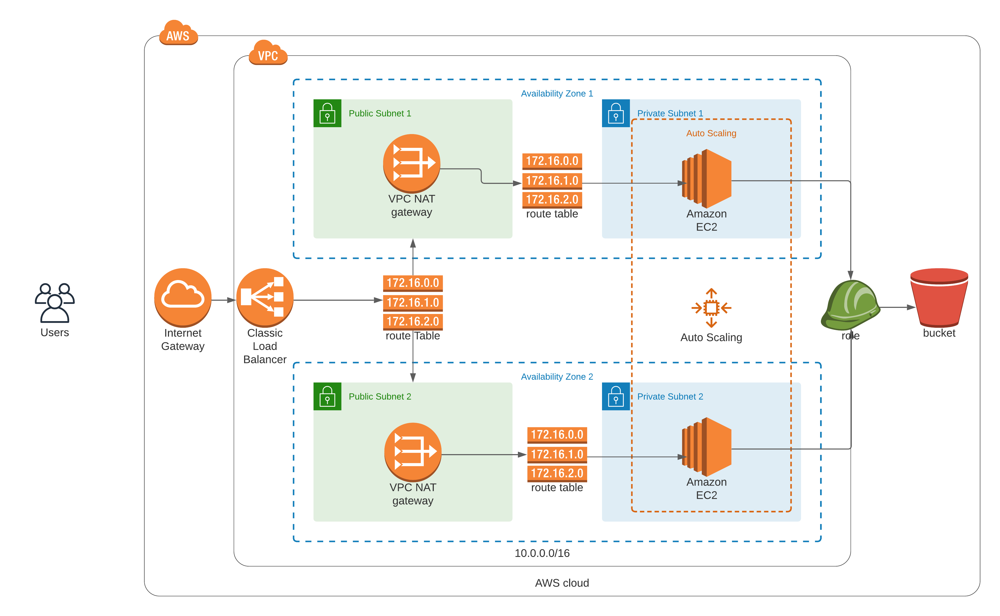

# Udagram


This is a solution for the Deploy a high-availability web app using using Cloudformation project for the Udacity Devops Nanodegree course.

To see my deployment, go to [udagram](http://udagr-webap-yysnr04sspmq-1208251166.us-east-1.elb.amazonaws.com/).

Here is the picture of the working page:


Diagram for the whole infrastructure:



## Prerequisites
- An AWS account
- The AWS CLI (https://aws.amazon.com/cli/)

### Deploying your website
Using the AWS CLI, run:

```bash
sh create.sh <stack_name> udagram.yml udagram-params.json
```

To update the current stack run:
```bash
sh update.sh mystack udagram.yml udagram-params.json
```

To delete stack run:
```bash
sh update.sh mystack udagram.yml udagram-params.json
```
